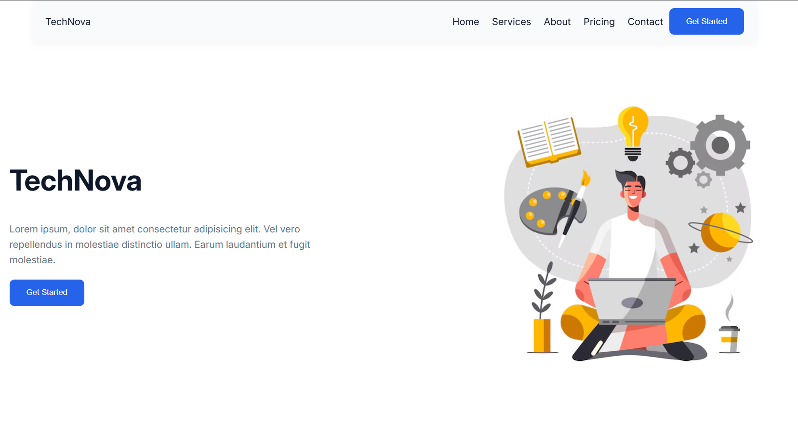

# 🚀 TechNova – Landing Page

TechNova is a modern, responsive **landing page** for a tech company or startup.
The project focuses on clean UI design, responsive layout, and well-structured HTML & CSS.

---

## 🌐 Live Preview



---

## 📌 Features

* ✅ Fully responsive design (Desktop, Tablet, Mobile)
* ✅ Modern UI / UX
* ✅ Sticky navigation bar
* ✅ Mobile hamburger menu
* ✅ Clean and organized sections
* ✅ Reusable CSS variables

---

## 🧱 Sections Included

* **Hero Section** – Introduction & call to action
* **Services** – Overview of offered services
* **About Us** – Company introduction and values
* **Why Choose Us** – Key features and strengths
* **Testimonials** – Client feedback cards
* **Pricing Plans** – Subscription plans with highlighted popular plan
* **Contact** – Contact form for users
* **Footer** – Social links and copyright

---

## 🛠️ Built With

* **HTML5** – Semantic structure
* **CSS3** – Flexbox, Grid, Media Queries
* **JavaScript (Vanilla)** – Mobile menu toggle
* **Google Fonts** – Inter font family

---

## 📂 Project Structure

```
TechNova/
│
├── index.html
├── style.css
├── images/
│   ├── hero.jfif
│   ├── check-mark.png
│   └── ...
└── README.md
```

---

## 📱 Responsive Design

* Desktop: Full layout with grid & flexbox
* Tablet: Adjusted grids and spacing
* Mobile:

  * Hamburger navigation menu
  * Stacked sections
  * Single-column layouts

---

## 🎯 Purpose of This Project

This project was built to:

* Practice **HTML & CSS layout techniques**
* Improve **responsive web design skills**
* Build a **portfolio-ready landing page**

---

## 🚀 Future Improvements

* Dark mode support
* React version of the landing page
* Form validation with JavaScript
* Animations using CSS or Framer Motion

---

## 👨‍💻 Author

**Ahmed Moatemed**
Computer Science | Frontend Developer

* GitHub: https://github.com/ahmed-moatemed*
* LinkedIn: https://www.linkedin.com/in/ahmed-ibrahim-moatemed-00253b268/*
* My Portfolio: https://mo3temed.netlify.app/* 

---

## 📄 License

This project is open source and available for learning and personal use.

---
